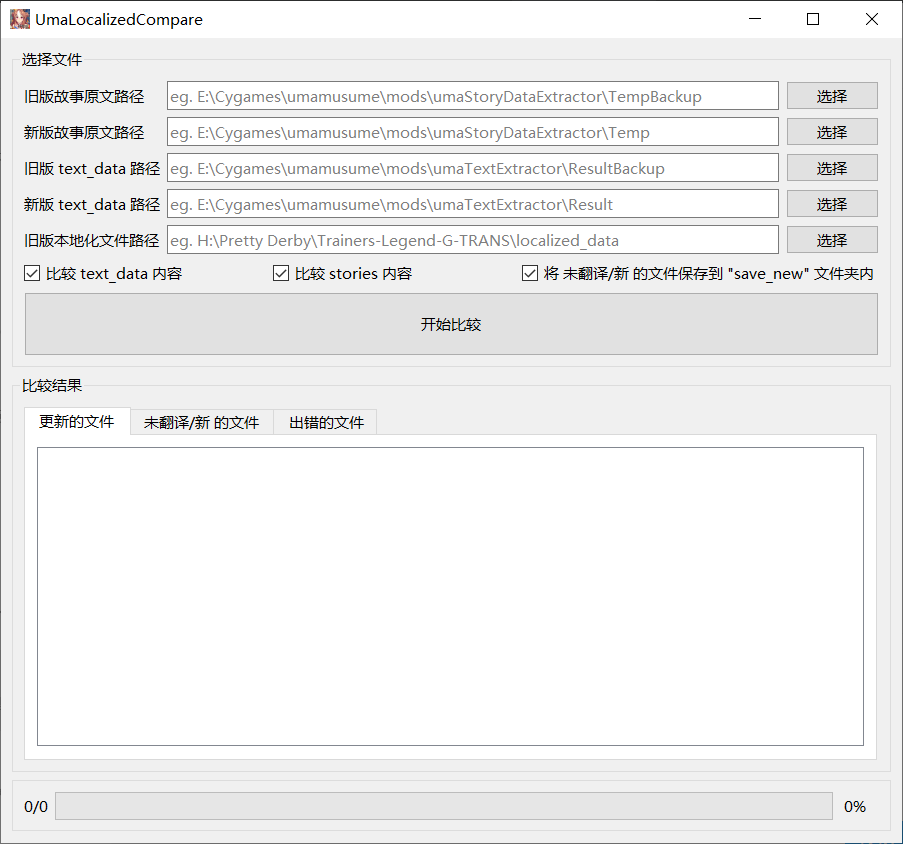

# tlg-text-update-compare
- compare updated text / 比较提取的更新文本

# 相关工具

- [https://share.weiyun.com/Vjpdrl1I](https://share.weiyun.com/Vjpdrl1I) 马娘汉化相关 -> 工具

## 工具说明

- [UmaTextExtractor](https://github.com/akemimadoka/UmaTextExtractor) - 提取 text_data
  - `.\UmaTextExtractor.exe C:\Users\UserName\AppData\LocalLow\Cygames\umamusume\master\master.mdb Result`

- [UmamusumeStoryDataExtractor](https://github.com/akemimadoka/UmamusumeStoryDataExtractor) - 提取故事文本
  - `.\UmamusumeStoryDataExtractor.exe C:\Users\UserName\AppData\LocalLow\Cygames\umamusume Temp`

# 界面预览 / UI Preview

- UI supports Chinese and English.

